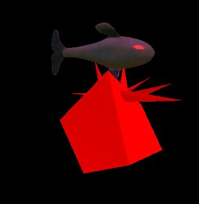

# threeJS-SAMPLER
Cassandra Ravenbrook

Assets:  (KEEP TRACK OF WHAT YOU USE AND PROVIDE ATTRIBUTION)

"Denim Whale Plush" by Mattyew is licensed under Creative Commons Attribution. https://skfb.ly/YIrU To view a copy of this license, visit http://creativecommons.org/licenses/by/4.0/.

Lidded ritual ewer (huo) in the form of an elephant with masks and dragons
https://3d.si.edu/object/3d/lidded-ritual-ewer-huo-form-elephant-masks-and-dragons:d8c63598-4ebc-11ea-b77f-2e728ce88125

"Egyptian Cat Low Poly" by truong365 is licensed under Creative Commons Attribution. https://skfb.ly/6WOQr To view a copy of this license, visit http://creativecommons.org/licenses/by/4.0/.

"Athena Bust" by 3DWP is licensed under CC Attribution-NonCommercial-ShareAlike. https://skfb.ly/6xGDQ To view a copy of this license, visit http://creativecommons.org/licenses/by-nc-sa/4.0/.

"Ulysses, King of Ithaca" by T.Koeniger is licensed under Creative Commons Attribution. https://skfb.ly/6WMtK To view a copy of this license, visit http://creativecommons.org/licenses/by/4.0/.